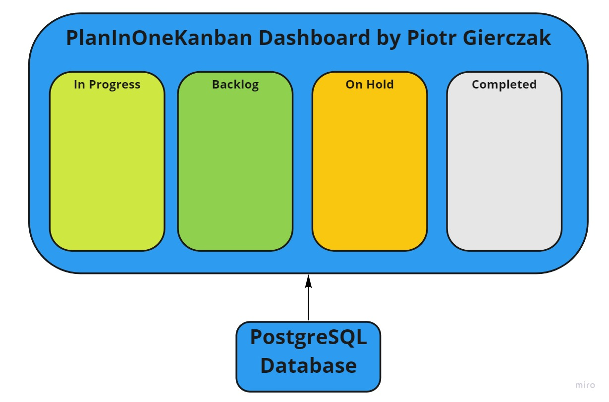

Developer Name: Piotr Gierczak

Project Name: PlanInOneKanban

Description: Application for managing tasks and teams, using Kanban methodology.

Language: Java + HTML + CSS

Database: PostgreSQL

(Readme file will include more information in later stages of design)
