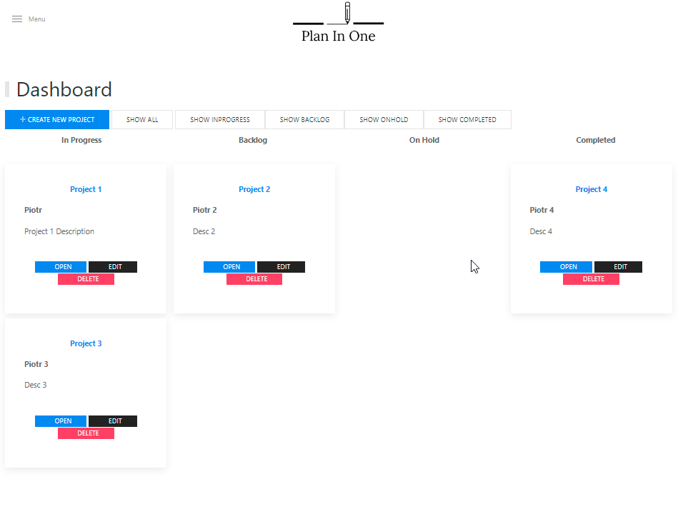

Developer Name: Piotr Gierczak

Project Name: PlanInOneKanban

Language: Java + HTML + CSS

Database: PostgreSQL

Application can be used for teams and project managament.

You can create projects and show them on Kanban Board.
Based on Status of the Project it is splited on 4 collumns, "In Progress", "Backlog", "On Hold", "Completed".

Each ticket has its own title, description, status, due date, and assigned to field. There are simple filters depending on ticket type.
Try it!

Link to application on heroku: https://planinonekanban.herokuapp.com/

Repository upload to Heroku instruction:
1. Open Repository in Intellij or simmilar
2. Open Terminal on main project directory
3. Create heroku application with comend: "heroku create"
4. Create Posgresql database with comend: "heroku addons:create heroku-postgresql"
5. Optional: Change application name with comand: "heroku apps:rename <new app name>"
6. Push/Update Git repository to Heroku with comand: "git push heroku master"
7. Open app with comand: "heroku open"

